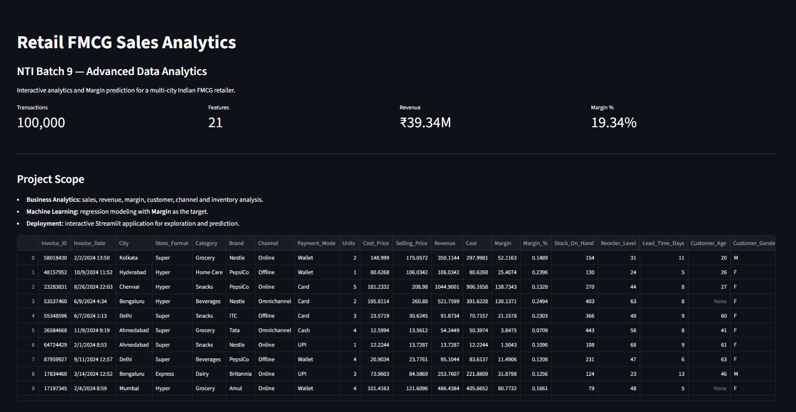
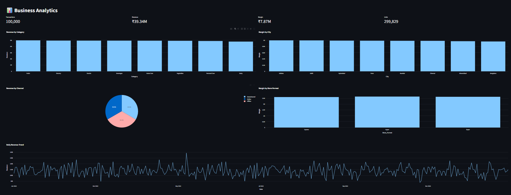
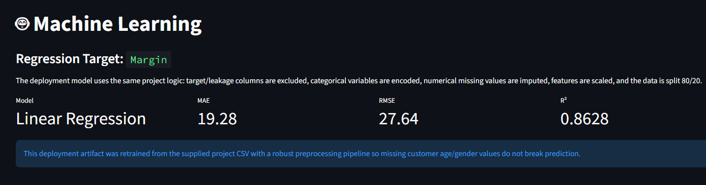
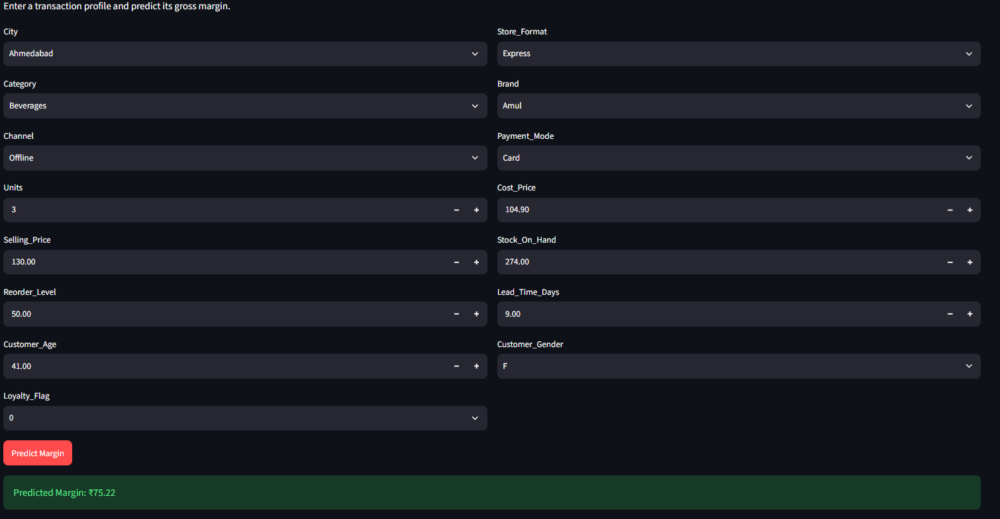
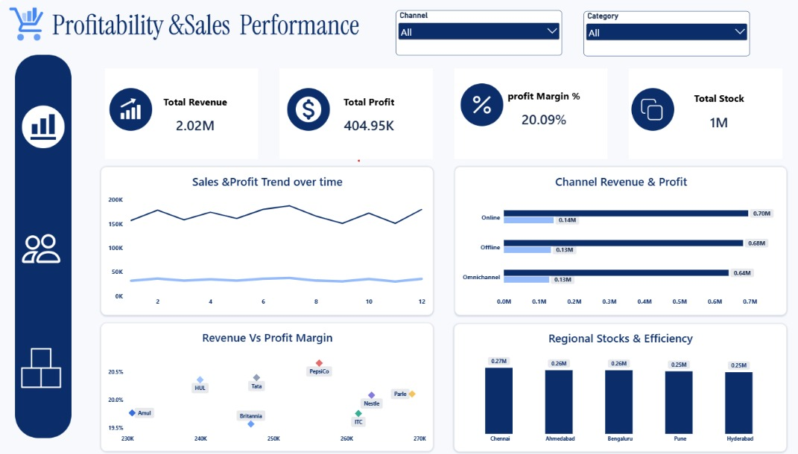
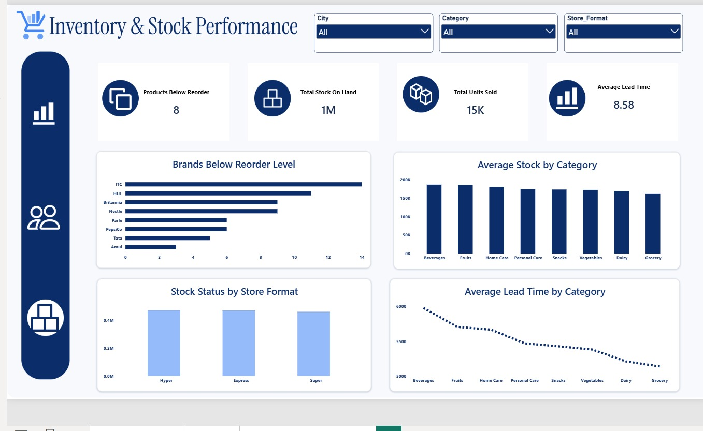

# 🛒 Retail FMCG Sales Analytics — NTI Batch 9

[](https://retail-fmcg-analytics.streamlit.app/)
[](https://www.python.org/)
[](https://pandas.pydata.org/)
[](https://scikit-learn.org/)
[](https://plotly.com/)
[](License)

## 📌 Project Overview

This project was developed as part of **NTI Batch 9 — Advanced Data Analytics**.

The project focuses on analyzing an **Indian FMCG Retail Sales dataset for 2024** to discover business insights related to sales, revenue, profitability, customer behavior, store performance, and inventory.

The project combines:

- 📊 Exploratory Data Analysis (EDA)
- 🧹 Data Quality & Cleaning
- 📈 Business Analytics & Visualization
- 🤖 Regression-based Machine Learning
- 📉 Model Evaluation
- 🌐 Interactive Streamlit Deployment

## 🎯 Project Objectives

The main objectives are to:

1. Analyze sales and profitability across FMCG categories and brands.
2. Compare online, offline, and omnichannel performance.
3. Understand customer and loyalty behavior.
4. Explore inventory and stockout-related patterns.
5. Evaluate store-format efficiency.
6. Build a regression model to predict **Margin**.
7. Deploy the analytical solution as an interactive web application.

## 🗂️ Dataset

**Dataset:** Indian FMCG Retail Sales — 2024

- **Records:** 100,000
- **Variables:** 21
- **Period:** Full year 2024
- **Domain:** FMCG Retail
- **Target Variable:** `Margin`

The dataset contains information related to products, customers, sales, revenue, cost, stores, cities, sales channels, payment methods, loyalty, inventory, reorder points, lead times, and dates.

## 🔍 Key Business Questions

The analysis addresses questions such as:

- Which product categories and brands are the most profitable?
- How do online and offline channels compare?
- How does loyalty behavior relate to purchasing patterns?
- Which products or stores may face higher inventory risk?
- Which store formats perform more efficiently?

## 🧠 Machine Learning

The modeling workflow includes:

1. Target and leakage/redundant columns removal.
2. Feature preparation and categorical encoding.
3. Missing-value handling.
4. 80/20 train-test split.
5. Feature scaling.
6. Regression model training.
7. Evaluation using:
   - MAE
   - MSE
   - RMSE
   - R²

### Final Deployment Model

**Linear Regression**

| Metric | Score |
|---|---:|
| MAE | 19.28 |
| RMSE | 27.64 |
| R² | 0.863 |

> The deployed model predicts **Margin** from the available business and transactional features.

## 📊 Streamlit Application

The deployed application contains five main sections:

### 🏠 Overview
High-level KPIs and an overview of the FMCG dataset.

### 📊 Analytics
Interactive business visualizations covering sales, profitability, customers, channels, and stores.

### 🧹 Data Quality
Exploration of missing values, duplicates, and dataset quality indicators.

### 🤖 Machine Learning
Model information, evaluation metrics, and the regression workflow.

### 🔮 Prediction
Interactive **Margin Prediction** using the trained model.

## 📊 Power BI Dashboards

The project includes interactive Power BI dashboards for monitoring
sales, profitability, inventory performance, and operational efficiency.


### 🏠 Streamlit Overview

The Overview page provides a high-level summary of the Indian FMCG retail dataset and the deployed analytics solution.

It presents key business indicators including:

- **100,000** retail transactions
- **21** dataset features
- **₹39.34M** total revenue
- **19.34%** average margin percentage

The page also introduces the project scope, covering Business Analytics, Machine Learning, and interactive Streamlit deployment.

<details>
<summary>▶️ Click to show Streamlit Overview</summary>



</details>

### 📊 Business Analytics

The Analytics page provides interactive visualizations to explore sales and business performance across different dimensions.

Key insights include:

- Revenue by product category
- Margin by city
- Revenue distribution by sales channel
- Margin performance by store format
- Daily revenue trends throughout 2024

These visualizations help transform transactional data into actionable business insights.

<details>
<summary>▶️ Click to show Business Analytics</summary>



</details>


### 🤖 Machine Learning

The Machine Learning module focuses on predicting **Margin** as the regression target.

The deployed solution applies a complete preprocessing and modeling pipeline that includes:

- Target and leakage-related feature exclusion
- Categorical feature encoding
- Missing-value imputation
- Feature scaling
- 80/20 train-test split
- Regression model evaluation

The deployed model is **Linear Regression**, with performance evaluated using:

- **MAE** — Mean Absolute Error
- **RMSE** — Root Mean Squared Error
- **R²** — Coefficient of Determination

<details>
<summary>▶️ Click to show Machine Learning</summary>



</details>

### 🔮 Margin Prediction

The Prediction module provides an interactive interface for estimating the gross margin of a retail transaction.

Users can enter a transaction profile including:

- City
- Store Format
- Category
- Brand
- Sales Channel
- Payment Method
- Units
- Cost Price
- Selling Price
- Stock on Hand
- Reorder Level
- Lead Time
- Customer Age
- Customer Gender
- Loyalty Flag

After submitting the transaction profile, the deployed machine learning model generates an estimated **Margin** value.

This demonstrates the transition from analytical modeling to an interactive, user-facing machine learning application.

<details>
<summary>▶️ Click to show Margin Prediction</summary>



</details>

### 💰 Profitability & Sales Performance

<details>
<summary>▶️ Click to show Profitability & Sales Performance</summary>



</details>

### 📦 Inventory & Stock Performance

<details>
<summary>▶️ Click to show Inventory & Stock Performance</summary>



</details>

## 🛠️ Tech Stack

| Technology | Purpose |
|---|---|
| Python | Core programming |
| Pandas | Data manipulation & analysis |
| NumPy | Numerical computing |
| Scikit-learn | Machine Learning |
| Plotly | Interactive visualization |
| Streamlit | Web application & deployment |
| Git & GitHub | Version control |
| Power BI | Business intelligence & dashboarding |

## 📁 Project Structure

```text
Retail-FMCG-Analytics/
│
├── app.py                 # Streamlit application
├── data.csv               # FMCG dataset
├── model.pkl              # Trained ML pipeline
├── model_info.json        # Model metadata & metrics
├── requirements.txt       # Python dependencies
├── README.md              # Project documentation
└── LICENSE                # MIT License
```

## 🚀 Run Locally

Clone the repository and install the dependencies:

```bash
git clone https://github.com/Fadydesoky/Retail-FMCG-Analytics.git
cd Retail-FMCG-Analytics

pip install -r requirements.txt
streamlit run app.py
```

## 🌐 Live Demo

**Streamlit Application:**

🚀 **[Open Live Streamlit Application](https://retail-fmcg-analytics.streamlit.app/)**

💻 **[View Source Code on GitHub](https://github.com/Fadydesoky/Retail-FMCG-Analytics)**

## 👥 Prepared By

### NTI Batch 9 — Advanced Data Analytics

1. **Fady Desoky Saeed Abdelaziz**
2. **Marwan Tamer Mohamed Ahmed**
3. **Farah Ali Said Ali**
4. **Maria Ayman Maurice Nashed**

## 📜 License

This project is licensed under the **MIT License**.

See the [License](License) file for details.

---

### ⭐ NTI Batch 9 — Advanced Data Analytics

**Retail FMCG Sales Analytics | 2024**

[⬆️ Back to Top](#-retail-fmcg-sales-analytics--nti-batch-9)
